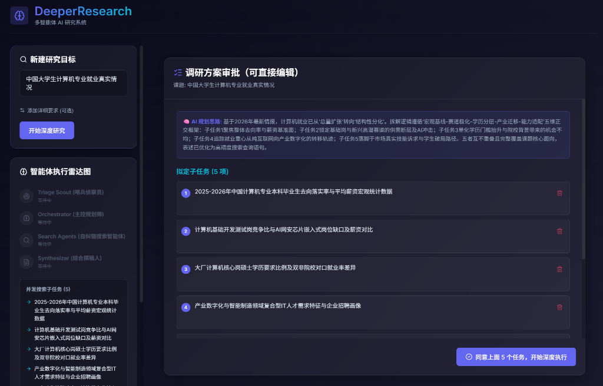
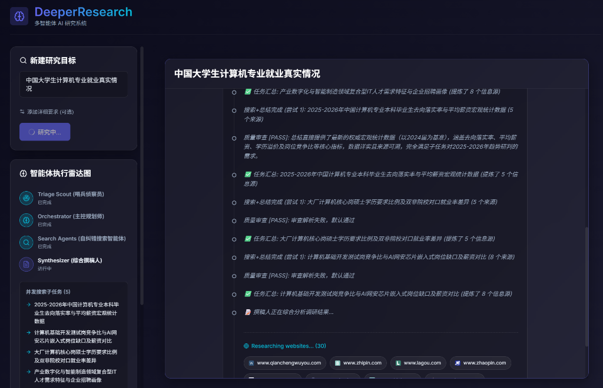
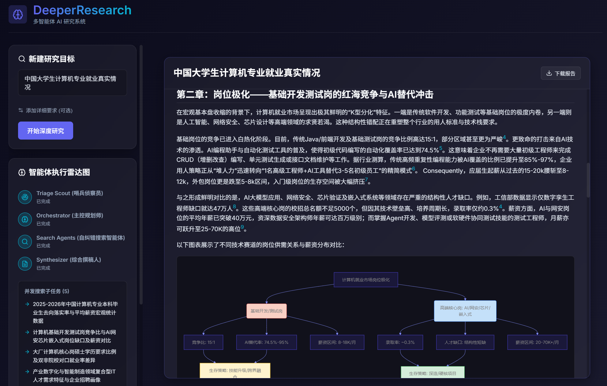

# DeeperResearch 🤖🔍

DeeperResearch是一个基于多智能体协作（Multi-Agent）深度研究系统，能够将宏大的模糊课题自动拆解，通过并行联网搜索、智能体内部审查与自纠错，最终撰写生成包含严谨数据、文献来源指向及可视化图表的深度研究长文。

## ✨ 核心特性

- **🧠 模型即搜索 (Search-In-LLM)**：深度集成阿里云 DashScope 内置的 `enable_search` 搜索引擎，一次调用完成检索与提炼的无缝协同。
- **⚙️ 多智能体协同 (LangGraph)**：
  - **哨兵侦察 (Triage)**：根据用户主命题发起前置预搜，提炼时效背景（用于打破规划时空幻觉）。
  - **全局规划师 (Orchestrator)**：洞悉破冰资料，自动将命题切解为 3-5 个独立且完备的专业子任务。
  - **自纠错研究员 (Search Workers)**：并行派发执行搜索子任务，且每个 Worker **均内置自我质量审查循环**。若获取内容跑题，其会自动优化关键词进行最多 2 次重头捞取。
  - **综合撰稿人 (Synthesizer)**：最终融合所有的知识库，遵循规范生成图文并茂的专业级研报。
- **👤 Human-in-the-Loop 审批环**：规划师拆解完子任务后，系统会先将调研方案呈现给用户审批。用户可确认开始执行，也可填写反馈意见触发规划师重新拆解，循环往复直到满意才正式开始调研。
- **💫 动态交互感知 (UI)**：带有动态节点状态机展示，通过 HTTP Server-Sent Events (SSE) 长连接，实现整个 LangGraph 思维链路和状态转移的可视化实时呈现。
- **🎯 用户自定义要求**：支持在输入研究主题时额外填写详细要求（如“重点分析技术架构”“用学术论文风格”等），要求会同时注入规划师和撰稿人，影响子任务拆解方向和报告写作风格。
- **💾 轻量级持久化**：报告生成完成后自动缓存至浏览器 localStorage，防止误触刷新丢失。同时支持一键导出为 Markdown 文件。

## 📸 界面展示






## 🛠️ 技术栈

- **引擎之心**：`LangGraph`, `LangChain`, `OpenAI SDK`
- **后端服务**：`Python 3.9+`, `FastAPI`, `Pydantic`, `Uvicorn`
- **前端可视化**：`React 18`, `TypeScript`, `Vite`, `React-Markdown`, `Mermaid.js`
- **搜索服务**：阿里云 `DashScope` (通义千问大语言模型底座扩展)

## 📂 核心目录结构

```text
DeeperResearch/
├── backend/                  # 🧠 大模型研究后端
│   ├── agent/                # 智能体执行中枢
│   │   ├── graph.py          # 路由流转与工作流拓扑构建 (含规划图 + 执行图)
│   │   ├── nodes.py          # 具体角色逻辑节点库 (Triage, Orchestrator 等)
│   │   ├── prompts.py        # Master 级系统提示词库 (含重规划模板)
│   │   ├── state.py          # 跨节点全局记忆与状态维持机制
│   │   └── tools.py          # URL提取与聚合搜索工具
│   ├── main.py               # SSE 服务端 (/plan + /execute 双阶段端点)
│   └── config.py             # 全局环境依赖配置项
├── frontend/                 # 🔭 可视化交互前端
│   ├── src/
│   │   ├── api/              # 流式接驳事件解析引擎 (streamPlan / streamExecute)
│   │   ├── components/       # 解耦渲染 UI
│   │   │   ├── PlanReview    # 调研方案审批面板 (Human-in-the-Loop)
│   │   │   ├── GraphVisualizer  # 动态状态机可视化
│   │   │   ├── ResultDisplay    # Markdown 报告渲染 + Mermaid 图表
│   │   │   └── ResearchForm     # 研究目标输入表单
│   │   ├── App.tsx           # 两段式审批流主调度器
│   │   └── index.css         # 赛博深色系渐变设计美学
└── .env.example              # 开放环境变量参照模板
```

## 🚀 快速启动

你需要安装 Python 3.9+ 以及 Node.js。

### 1. 后端依赖与启动

```bash
# 建议在独立虚拟环境中运行
python -m venv .venv
source .venv/Scripts/activate  # Windows 终端激活指令

# 安装后端必要库
pip install -r backend/requirements.txt
```

复制配置文件并配置你自己的 API Key (请确保使用千问大模型以及填写相对应的 Endpoint)：
```bash
cp .env.example .env
```
用编辑器打开 `.env` 并填写对应的信息。

运行 FastAPI 业务引擎：
```bash
uvicorn backend.main:app --host 0.0.0.0 --port 8000 --reload
```
后端将在 `http://0.0.0.0:8000` 启动。

### 2. 前端依赖与启动

打开一个新的终端会话，进入 `frontend` 目录：
```bash
cd frontend
npm install
npm run dev
```
按照控制台提示打开浏览器访问即可。

## 🗺️ 后续可演进方向 (ROADMAP)

**架构说明**：当前 DeeperResearch 主要作为个人本地使用工具，因此选择了轻量简单的直连流式通信。这种极简设计足以满足个人的独立研究需求，也避免了搭建复杂系统带来的额外维护成本。

如果未来项目计划在线上部署以提供给多用户并发使用，将演进以下架构机制以保障系统的容灾和稳定性：

- [ ] **异步任务队列持久化与连接恢复 (Job ID 机制)**
  - *当前局限*：现有的流式直连（Telephony 模式）非常脆弱，在复杂的研究周期（可能达数分钟）执行生成时若浏览器手动刷新导致连接重置切断，不仅中断任务并且无法断点续传。
  - *系统改造*：引入基于 `Redis / SQLite` 及异步任务队列 (`Celery` / `BackgroundTasks`)。前端发起任务后将拿到一个 `job_id`，利用状态轮询或重定位流式链接订阅图计算过程。即使浏览器刷新，只要持有该 `job_id` 便能瞬间重建之前运算积累的所有进度并在图上接续动画。
- [ ] **多平台与定制搜素环境引擎解绑 (Adapter Pattern 解耦)**
  - 将硬绑定的阿里云端内置搜索模式抽离解耦为搜索调用抽象层，支持自由配置并按需调度 Tavily / Bing  以便轻松跨任意通用型大模型（例如：DeepSeek, O1, Kimi 等）运作。
- [ ] **完整的数据库账号体系持久化**
  - 使用数据库完全托管历史草稿与知识溯源链接的持久保存。

## 📄 开源协议 (License)

本项目基于 [MIT License](./LICENSE) 开源。允许任何个人或企业免费使用、修改和分发，使用时请保留版权声明。
