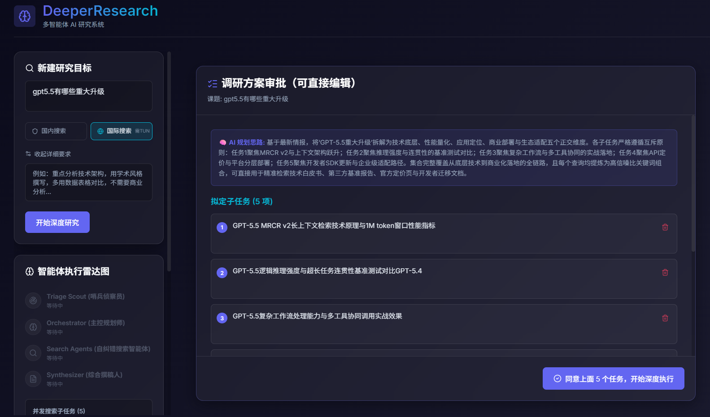
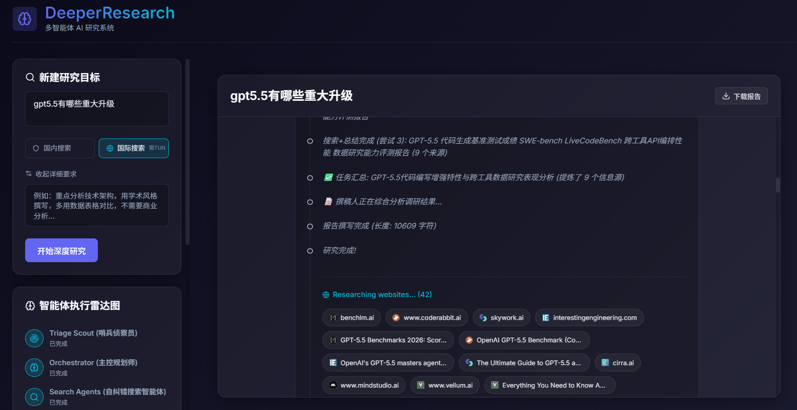
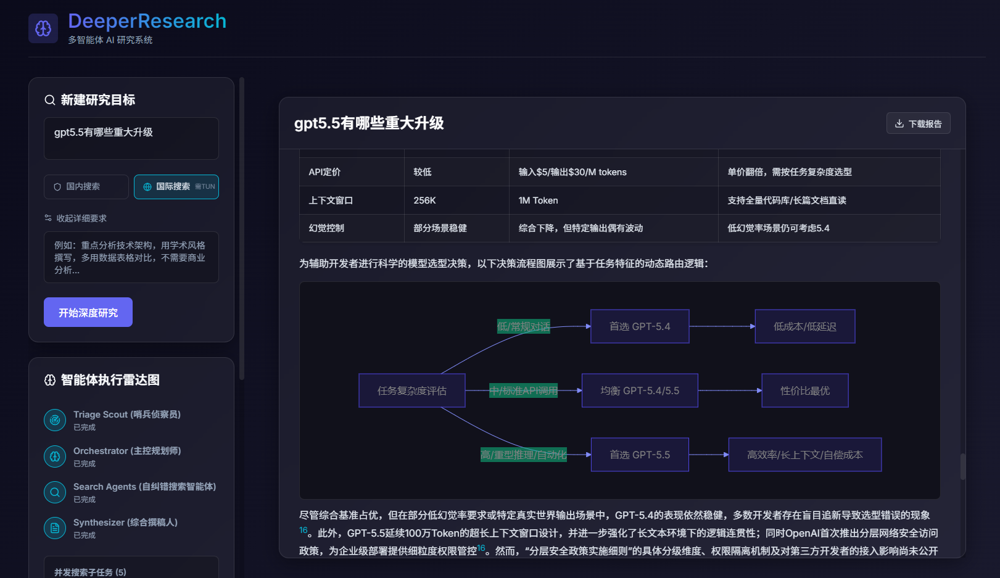

# DeeperResearch 🤖🔍

DeeperResearch是一个基于多智能体协作（Multi-Agent）深度研究系统，能够将宏大的模糊课题自动拆解，通过并行联网搜索、智能体内部审查与自纠错，最终撰写生成包含严谨数据、文献来源指向及可视化图表的深度研究长文。

## ✨ 核心特性

- **🧠 全模型即搜索 (Model-Agnostic Search)**：统一使用 AnySearch 检索底座，彻底去除大模型联网插件的厂商绑定，支持自主切换并使用 DeepSeek、OpenAI 等各种主流大模型作为后端。
- **🌐 零门槛免代理国内/国际搜索**：双引擎全部由 AnySearch 云端驱动，国内运行环境无需挂载任何科学上网 TUN 代理即可稳定直连全球检索；国际检索下自动将中文关键词意译翻译，保证英文高纯度文献的检索与召回。
- **⚙️ 多智能体协同 (LangGraph)**：
  - **哨兵侦察 (Triage)**：根据用户主命题发起前置预搜，提炼时效背景（用于打破规划时空幻觉）。
  - **全局规划师 (Orchestrator)**：洞悉破冰资料，自动将命题切解为 3-5 个独立且完备的专业子任务。
  - **自纠错研究员 (Search Workers)**：并行派发执行搜索子任务，且每个 Worker **均内置有状态的“认知墓碑”反思避障循环**。如果单次搜索总结被审查判定为不合格或数据空虚，系统会记录当前失败轨迹（检索词、原因、内容草稿）为“墓碑”，并在下一轮尝试的提炼和审查 Prompt 中进行定向规避，防止在雷同的空话废话中“鬼打墙”打转，强力确保重试探索的差异化深度。
  - **综合撰稿人 (Synthesizer)**：最终融合所有的知识库，遵循规范生成图文并茂的专业级研报。
- **👤 Human-in-the-Loop 审批环**：规划师拆解完子任务后，系统会先将调研方案呈现给用户审批。用户可确认开始执行，也可填写反馈意见触发规划师重新拆解，循环往复直到满意才正式开始调研。
- **💫 动态交互感知 (UI)**：带有动态节点状态机展示，通过 HTTP Server-Sent Events (SSE) 长连接，实现整个 LangGraph 思维链路和状态转移的可视化实时呈现。
- **🎯 用户自定义要求**：支持在输入研究主题时额外填写详细要求（如“重点分析技术架构”“用学术论文风格”等），要求会同时注入规划师和撰稿人，影响子任务拆解方向和报告写作风格。
- **📄 多格式文件上传**：集成 [MarkItDown](https://github.com/microsoft/markitdown)，支持上传 PDF / Word / Excel / PPT / Markdown 等多种格式文件作为参考材料，自动转换为 Markdown 注入研究流程，辅助规划师拆解子任务和撰稿人生成报告。
- **💾 轻量级持久化**：报告生成完成后自动缓存至浏览器 localStorage，防止误触刷新丢失。同时支持一键导出为 Markdown 文件。

## 📸 界面展示






## 🛠️ 技术栈

- **引擎之心**：`LangGraph`, `LangChain`, `OpenAI SDK`
- **后端服务**：`Python 3.9+`, `FastAPI`, `Pydantic`, `Uvicorn`
- **前端可视化**：`React 18`, `TypeScript`, `Vite`, `React-Markdown`, `Mermaid.js`
- **搜索服务**：`AnySearch API` 统一检索引擎 (国内/国际免代理直连双通道)
- **文件解析**：微软 `MarkItDown` (多格式文件转 Markdown)

## 📂 核心目录结构

```text
DeeperResearch/
├── backend/                  # 🧠 大模型研究后端
│   ├── agent/                # 智能体执行中枢
│   │   ├── graph.py          # 路由流转与工作流拓扑构建 (含规划图 + 执行图)
│   │   ├── nodes.py          # 具体角色逻辑节点库 (Triage, Orchestrator 等)
│   │   ├── prompts.py        # Master 级系统提示词库 (含重规划模板)
│   │   ├── state.py          # 跨节点全局记忆与状态维持机制
│   │   └── tools.py          # AnySearch 统一搜索入口 (国内/国际免代理直连)
│   ├── main.py               # SSE 服务端 (/plan + /execute + /upload 多端点)
│   └── config.py             # 全局环境依赖配置项
├── frontend/                 # 🔭 可视化交互前端
│   ├── src/
│   │   ├── api/              # 流式接驳事件解析引擎 (research.ts)
│   │   ├── components/       # 解耦渲染 UI
│   │   │   ├── PlanReview.tsx      # 调研方案审批面板 (Human-in-the-Loop)
│   │   │   ├── GraphVisualizer.tsx # 动态状态机可视化
│   │   │   ├── ResultDisplay.tsx   # Markdown 报告渲染 + Mermaid 图表
│   │   │   ├── ResearchForm.tsx    # 研究目标输入表单
│   │   │   └── SettingsModal.tsx   # 大模型与检索参数配置面板
│   │   ├── App.tsx           # 两段式审批流主调度器
│   │   └── index.css         # 赛博深色系渐变设计美学
└── .env.example              # 开放环境变量参照模板
```

## 🚀 快速启动

你需要安装 Python 3.9+ 以及 Node.js。

### 1. 后端依赖与启动

```bash
# 建议在独立虚拟环境中运行
python -m venv .venv
.venv/Scripts/activate  # Windows 终端激活指令

# 安装后端必要库
pip install -r backend/requirements.txt
```

创建本地运行配置文件并填写（可选：系统已支持网页端可视化配置，您完全可以直接在前端界面中录入 API Key 和修改各项参数，免去手动编辑 `.env` 的麻烦）：
```bash
cp .env.example .env
```
（直接保持 `.env` 为空，或不填任何 Key，直接启动服务，不影响使用！）

运行 FastAPI 业务引擎：
```bash
uvicorn backend.main:app --host 0.0.0.0 --port 8000 --reload
```
后端将在 `http://0.0.0.0:8000` 启动。

### 2. 前端依赖与启动

打开一个新的终端会话，进入 `frontend` 目录：
```bash
cd frontend
npm install
npm run dev
```
按照控制台提示打开浏览器访问即可。

## 📄 开源协议 (License)

本项目基于 [MIT License](./LICENSE) 开源。允许任何个人或企业免费使用、修改和分发，使用时请保留版权声明。
